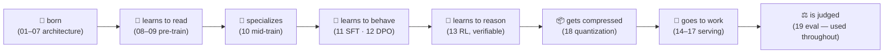

# 00 · The map

Before any detail, see the whole territory — and run the whole thing once.

## The lifecycle you're about to walk

A modern LLM isn't "a transformer." It's a *pipeline* that turns random weights
into a useful, served system. Every module in this course is one leg of it:

| Stage | What happens | Modules |
|-------|--------------|---------|
| **Born** | An architecture is chosen — attention, experts, prediction heads | 01–07 |
| **Learns to read** | Pre-training on lots of text: next-token prediction | 08–09 |
| **Specializes** | Mid-training: longer context, curated/annealed data | 10 |
| **Learns to behave** | SFT then DPO: follow instructions, prefer good answers | 11–12 |
| **Learns to reason** | RL with *verifiable* rewards (does the code pass?) | 13 |
| **Goes to work** | Inference & serving: KV cache, speculation, batching | 14–17 |
| **Gets compressed** | Quantization for speed/memory | 18 |
| **Is judged** | Evaluation — the honesty check, used throughout | 19 |

The trick to not getting lost: **it's always the same model.** You'll watch *one*
tiny checkpoint go all the way through:



## Run the whole lifecycle in 30 seconds

This trains a tiny model on a toy corpus and generates from it — the entire
arc (build → train → generate) in one command:

```bash
uv run python course/00-the-map/journey.py
```

You'll see the loss fall and a (barely) coherent sample:

```
loss: 5.7xx -> 2.x
sample: 'the baby whale learns to read the ...'
```

It won't be Shakespeare — it's a 2-layer, 64-dim model trained for a few seconds.
The point is that **the full loop works and you ran it.** Everything else in the
course is about making each leg of that loop *good*.

### The same thing, at scale

`journey.py` runs in-process so it's instant and testable. In real use you'd drive
the CLI (each has `--help`):

```bash
uv run baby-whale-v4 train-tokenizer ...   # Module 08
uv run baby-whale-v4 pretrain ...          # Module 09
uv run baby-whale-v4 generate ...          # Modules 14–17
```

## How to read the rest

Each module has five beats — **the wall → the idea → in the code → the payoff
(measured) → break it** — and three tracks (📖 Read, 🔨 Build, 🚀 Extend). Start
wherever the lifecycle table pulls you, but if in doubt, go in order: later legs
lean on earlier ones.

**Next:** [01 · Backbone](../01-backbone/README.md) — the skeleton every other module hangs on.
