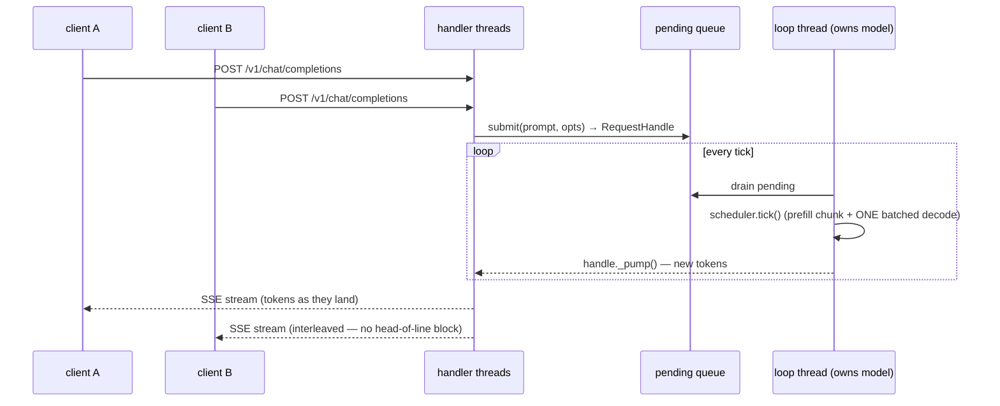

# 17 · Continuous batching

**Prereqs:** [14 · KV cache](../14-kv-cache/README.md) · **Unlocks:** production serving.

## 1 · The wall

Serving one request at a time leaves the GPU idle between tokens. But requests arrive
and finish at *different* times, and MLX isn't thread-safe — you can't just have handler
threads poke the model. How do you keep the GPU busy with many in-flight requests
without races?

## 2 · The idea

A single **loop thread owns the model**; HTTP handler threads only submit work and wait
on per-request signals. The loop **interleaves decode** across all live requests (no
head-of-line blocking), and **batches** them: same-length requests share one forward
(**cohort batching**), and different-length requests share one forward via **ragged
batching** (per-row positions + masks). Tokens stream back over **SSE**; if a client
disconnects, the request is **cancelled** so no compute is wasted.

## 🧩 From theory to code

Not an equation — a *concurrency protocol*. The whole design is four rules:

| The rule | The code (`serving.py`, `scheduler.py`, `batched.py`) | Why this |
|----------|-------------------------------------------------------|----------|
| one loop thread owns the model | `BatchingServer` loop | MLX isn't thread-safe — exactly one caller touches it |
| handlers submit work and wait on a signal | `RequestHandle` | HTTP threads never poke the model directly |
| interleave decode across all live requests | the scheduler tick | no request is stuck behind another (no head-of-line block) |
| batch same-length requests into one forward | `decode_group_batched` (+ `decode_ragged_batched`) | fill the GPU; mixed lengths still share a pass |

Why a single owner thread? it turns "many concurrent requests" into "one safe, always-busy
model loop" — correctness (no races) *and* throughput (batched forwards) at once.

## 3 · In the code

The loop that owns the model (`inference/serving.py`, `BatchingServer._loop`):

```python
while self._running:
    self._drain_control()                    # weight-sync etc. — exclusive model access
    drained = self._drain_pending()          # admit newly-submitted requests
    if self._scheduler.has_work():
        self._scheduler.tick()               # ONE tick: prefill chunk + batched decode
        for handle in self._tracked:
            handle._pump()                   # push fresh tokens to the waiting client
            if handle.state.finished:
                handle._finish()
    else:
        self._wake.wait(timeout=self._idle_timeout)   # idle — sleep until submit()
```

Handler threads only ever touch `submit()` and their own `RequestHandle` — never the model:




- `baby_whale_v4/inference/serving.py` — `class BatchingServer` (the loop, `RequestHandle`,
  `cancel()`).
- `baby_whale_v4/inference/scheduler.py` — cohorting; `ragged=True` for mixed lengths.
- `baby_whale_v4/inference/batched.py` — `decode_group_batched`, `decode_ragged_batched`.
- `baby_whale_v4/inference/server.py` — the HTTP + OpenAI-style chat surface.

## 4 · The payoff, measured

Concurrency and parity are proven in `tests/test_serving.py` and
`tests/test_batched_scheduler.py` — a short request isn't blocked behind a long one, and
batched decode is **token-identical** to per-request.

## 5 · Break it & reflect

- **Reflect (🔬 systems):** decode is memory-bandwidth-bound. Why does batching many
  requests raise throughput almost for free — and what does it cost in per-request latency?

- Toggle `RequestScheduler(ragged=True/False)` for a mix of prompt lengths — when do
  mixed-length requests actually share a forward?

**Next:** [18 · Quantization](../18-quantization/README.md) — make the weights small.
